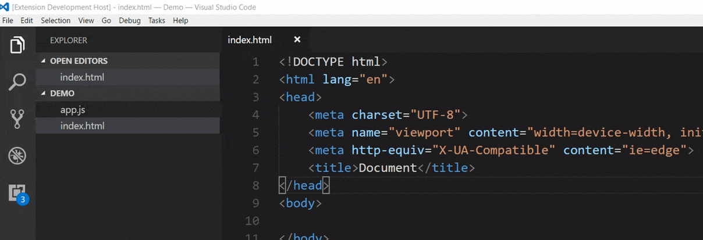

# Create File & Folder : On The Go

A small extension that help you to create files & folder in Atom Style.

## How to use?

1. Keyboard Shortcut: **`ctrl+alt+N`** to create new files &  **`ctrl+alt+shift+N`** to create new folders. _(you can override these shortcuts)_.

2. Press `ctrl+shift+p` to open command panel and type `Create File` or `Create Folder`.

3. Right click on Explorer Window and click `Create File` or `Create Folder`.

## Feature

* **Create Files or Folder** : Type ***`/path/subpath/TestPath`*** or ***`/path/subpath/fileName.js`***

* **Create Multiple files on the go :**
Type ***`/path/subpath/file1 > file2 > file3`*** to create multiple file (`file1`, `file2`, `file3`) at a time in `/path/subpath/` path.

## Installation
Open VSCode Editor and Press `ctrl+P`, type `ext install create-file-folder`.

## What is New ?

* #### Version 0.0.4 (30.09.2017)
    * Keyboard Shortcut added.
    * Small Fixes    

* #### Version 0.0.3 (28.09.2017)
    * File & Folder Detection Fixed.

* #### Version 0.0.2 (28.09.2017) 
    * Bug Fixed regarding backslash (`/`)
    * Preloaded file path fixed.
    * Intro Gif added in description.

## Changelog 
To see full Changelog, [click here](./CHANGELOG.md). 

## LICENCE
This extension is licensed under the [MIT LICENCE](./LICENCE)